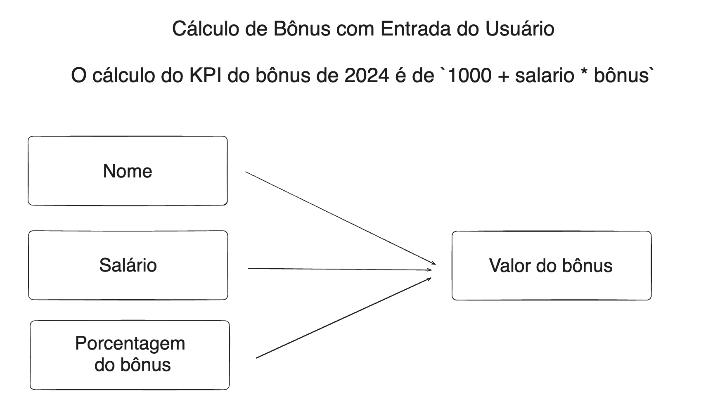

# **Bootcamp Aula 01**

Material da Aula 01, focado no setup inicial dasferramentas essenciais para a programção em Python: Python, Git&GitHub e VSCode.

Além de criar a primeira aplicação em Python.

## **Desafio do dia: Cálculo de Bônus com Entrada do Usuário**

Escreva um programa em Python que solicita ao usuário para digitar seu nome, ovalor do salário mensal e o valor do bônus que recebeu. O programa deve, então imprimir uma mensagem saudando o usuário pelo nome e informando o valor do salário em comparação com o bônus recebido.

O programa soicita o nome do usuário, salário e bônus, depois calcula o salário total.

No final exibe o resultado na tela.

## **Conclusão**

Nesta aula, aprendemos a configurar o ambiente de desenvolvimento para começar a programar em Python. Com o Python, o VSCode, e o Git instalados e configurados, estamos prontos para mergulhar mais fundo no mundo da programação!